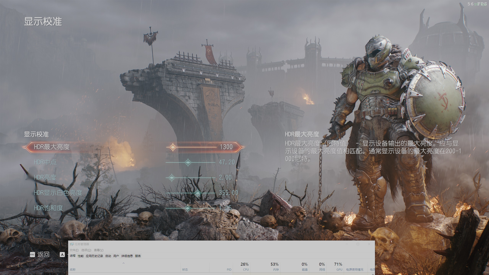

# BitBlt HDR
Fixes overexposed hdr screenshot for softwares that using Bitblt api

Using DXGI Desktop Duplication API and DX11 Compute Shader, It requires GPU that supports DX11 to works properly

### Result Image (using QQ Screenshot):

